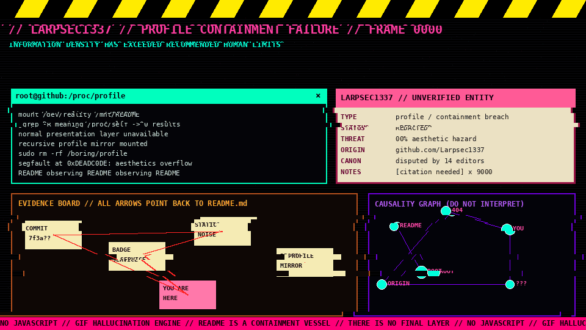
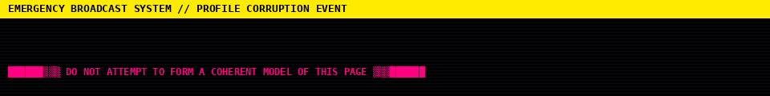
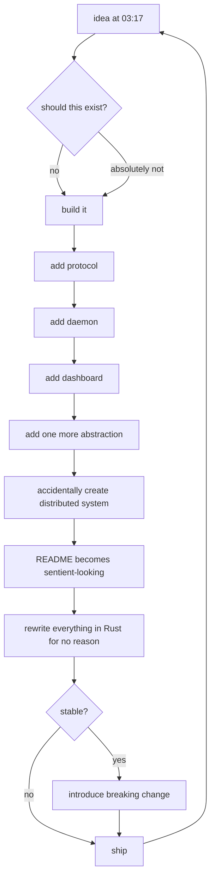

<!--
 ██████╗  ██████╗     ███╗   ██╗ ██████╗ ████████╗    ███████╗██████╗ ██╗████████╗
 ██╔══██╗██╔═══██╗    ████╗  ██║██╔═══██╗╚══██╔══╝    ██╔════╝██╔══██╗██║╚══██╔══╝
 ██║  ██║██║   ██║    ██╔██╗ ██║██║   ██║   ██║       █████╗  ██║  ██║██║   ██║
 ██║  ██║██║   ██║    ██║╚██╗██║██║   ██║   ██║       ██╔══╝  ██║  ██║██║   ██║
 ██████╔╝╚██████╔╝    ██║ ╚████║╚██████╔╝   ██║       ███████╗██████╔╝██║   ██║
 ╚═════╝  ╚═════╝     ╚═╝  ╚═══╝ ╚═════╝    ╚═╝       ╚══════╝╚═════╝ ╚═╝   ╚═╝

                    THE COMMENTS ARE ALSO PART OF THE PROFILE

      [0] README.md
      [1] README.md contains image of README.md
      [2] image is generated by script mentioned by README.md
      [3] script is regenerated by workflow described by README.md
      [4] workflow edits the repository containing README.md
      [5] therefore README.md is indirectly editing itself
      [6] do not investigate further
-->

<div align="center">

# ⚠️ `LARPSEC1337` ⚠️

### `UNAUTHORIZED PROFILE RENDER DETECTED // VISUAL CONTAINMENT FAILURE`





</div>

<table>
<tr>
<td width="33%" valign="top">

## `CASE FILE 0x539`

**Subject:** `Larpsec1337`  
**Classification:** `PROFILE ENTITY`  
**Render mode:** `hostile`  
**Markup:** `overpressurized`  
**Canonical status:** `disputed`  
**Normality:** ~~enabled~~ `REMOVED`  
**README nesting depth:** `∞ - 1`  
**Last seen:** `inside this table`

> [!CAUTION]
> Reading the profile linearly is unsupported behavior.

</td>
<td width="34%" valign="top">

## `LIVE DIAGNOSTICS`


```txt
SIGNAL ............ LOCKED
SANITY ............ N/A
HTML .............. SANITIZED
GIF ENGINE ........ ARMED
RECURSION ......... DETECTED
README ............ AWARE*

* legally this is a joke
```

</td>
<td width="33%" valign="top">

## `INDEX OF FORBIDDEN INTERPRETATIONS`

- The red line means nothing.
- The purple line also means nothing.
- If two boxes are connected, this proves nothing.
- If they are **not** connected, this proves even less.
- Every citation points to another citation.
- Every legend has a second, contradictory legend.
- The map is not the territory.
- The territory is currently returning HTTP 418.

</td>
</tr>
</table>

---

# `▓▒░ START OF DOCUMENT THAT SHOULD NOT HAVE PASSED PEER REVIEW ░▒▓`

> [!WARNING]
> This page is intentionally designed as an information-density joke. It contains fake terminals, fake system warnings, contradictory diagrams, recursive references, and visual noise. None of the “alerts” are real.

<details open>
<summary><b>██ CLICK TO COLLAPSE LEVEL-1 CONTAINMENT ████████████████████████</b></summary>

### `THE LARPSEC1337 MODEL OF SOFTWARE DEVELOPMENT`



</details>

<table>
<tr>
<td width="50%" valign="top">

## `THREAD No. 0xDEADC0DE`

**Anonymous 10/10/26(Sat)13:37:00 No.1337**

>be me  
>open github profile  
>profile contains a graph  
>graph says profile contains graph  
>click details  
>details contains smaller profile  
>smaller profile claims parent profile is fake  
>check source  
>source contains ASCII diagram of source  
>close tab  
>tab reopens spiritually

**Anonymous 10/10/26(Sat)13:38:11 No.1338**

`meds?` No. This is CSS withdrawal.

**Anonymous 10/10/26(Sat)13:39:59 No.1339**

```
> github strips javascript
> OP responds by compiling the hallucination into a GIF
```

</td>
<td width="50%" valign="top">

## `WIKI INFOBOX THAT HAS ESCAPED ITS ARTICLE`

| FIELD | VALUE |
|---|---|
| **Name** | `Larpsec1337` |
| **Species** | GitHub user |
| **Occupation** | stack trace archaeologist |
| **Known for** | turning READMEs into containment incidents |
| **First appearance** | commit `????????` |
| **Last appearance** | directly behind you, metaphorically |
| **Alignment** | `undefined behavior` |
| **Canonical color** | `#ff007f` according to one editor |
| **Counterclaim** | `#00ffd5` according to another editor |
| **Truth value** | merge conflict |

> [!IMPORTANT]
> This infobox is not authoritative. The other infobox is even less authoritative.

</td>
</tr>
</table>

---

# `SYSTEM MAP / DO NOT USE FOR NAVIGATION`

```txt
                                      ┌─────────────────────────┐
                                      │      github.com         │
                                      │      /Larpsec1337       │
                                      └────────────┬────────────┘
                                                   │
                                        HTTPS / vibes / ???
                                                   │
         ┌─────────────────────────────────────────▼─────────────────────────────────────────┐
         │                                  README.md                                        │
         │  ┌────────────────┐    ┌────────────────┐    ┌────────────────────────────────┐   │
         │  │ fake terminal  │───▶│ fake wiki      │───▶│ evidence board                 │   │
         │  └───────┬────────┘    └───────┬────────┘    └──────────────┬─────────────────┘   │
         │          │                     │                            │                     │
         │          ▼                     ▼                            ▼                     │
         │  ┌───────────────┐     ┌───────────────┐          ┌──────────────────┐            │
         │  │ animated GIF  │◀────│ Python script │◀─────────│ GitHub Action    │            │
         │  └───────┬───────┘     └───────────────┘          └────────┬─────────┘            │
         │          │                                                │                      │
         │          └───────────────────┐              ┌──────────────┘                      │
         │                              ▼              ▼                                     │
         │                         ┌────────────────────────┐                                 │
         │                         │ same repository       │                                 │
         │                         └────────────┬───────────┘                                 │
         └──────────────────────────────────────│─────────────────────────────────────────────┘
                                                │
                                                └──────────────▶ README.md
                                                                 ▲
                                                                 │
                                                     THIS IS THE LOOP
```

---

<div align="center">

## `TELEMETRY FROM THE MACHINE`


</div>

---

# `THE TECHNOLOGY ALTAR`

<div align="center">


</div>

```text
                    ┌──────────── COMPILER CULT ────────────┐
                    │                                        │
                    │   C ───────▶ undefined behavior        │
                    │   C++ ─────▶ templated behavior        │
                    │   Rust ────▶ behavior proven by court  │
                    │   Python ──▶ behavior at runtime       │
                    │   Bash ────▶ behavior by accident      │
                    │                                        │
                    └────────────────────────────────────────┘
```

---

<details>
<summary><b>OPEN THE REDACTED DOSSIER [CLEARANCE: WHO CARES]</b></summary>

```txt
╔═══════════════════════════════════════════════════════════════════════════════════╗
║                                  FILE 13/37                                        ║
╠════════════════════════════════════════════════════════════════════════════════════╣
║ SUBJECT: LARPSEC1337                                                              ║
║                                                                                    ║
║  ███████████████████████████████████████  claims to write software.                ║
║                                                                                    ║
║  Investigation discovered:                                                         ║
║   [✓] source files                                                                 ║
║   [✓] commits                                                                      ║
║   [✓] unreasonable terminal theming                                                ║
║   [✓] at least one file named final_FINAL_v2                                      ║
║   [ ] evidence of stopping after MVP                                               ║
║                                                                                    ║
║  Recommendation: DO NOT LET SUBJECT DISCOVER ANOTHER WINDOW MANAGER.               ║
╚═══════════════════════════════════════════════════════════════════════════════════╝
```

</details>

<details>
<summary><b>OPEN SECOND DOSSIER THAT CONTRADICTS THE FIRST DOSSIER</b></summary>

### Correction notice

The previous dossier is misinformation produced by the **Department of Accurate Documentation**.

The following statements supersede it:

1. There was never a first dossier.
2. This is the first dossier.
3. Item 2 was added before item 1.
4. The document revision history is classified by the document itself.
5. `git blame` has refused to cooperate.
6. The merge conflict has achieved procedural personhood.

</details>

---

# `LOG STREAM`

```log
[00:00:01] kernel: mounted /dev/profile at /home/Larpsec1337
[00:00:02] readme: normal introduction not found
[00:00:03] readme: injecting 14 unnecessary visual metaphors
[00:00:04] renderer: github sanitizer detected
[00:00:05] renderer: javascript capability = denied
[00:00:06] renderer: switching to pre-rendered animated hallucination protocol
[00:00:07] wiki: citation [1] cites citation [2]
[00:00:08] wiki: citation [2] cites citation [1]
[00:00:09] logic: infinite loop promoted to stable feature
[00:00:10] graphics: information density exceeds recommended daily allowance
[00:00:11] visitor: scrolled further anyway
[00:00:12] system: fascinating
```

---

<table>
<tr>
<td>

### `ERROR DIALOG #1`

```txt
┌─ README.EXE ──────────────────────────┐
│                                      │
│  An unknown meaning has occurred.    │
│                                      │
│  [ ABORT ] [ RETRY ] [ OPEN 9 TABS ] │
└──────────────────────────────────────┘
```

</td>
<td>

### `ERROR DIALOG #2`

```txt
╔═ SYSTEM MESSAGE ═════════════════════╗
║                                     ║
║  You cannot close README.EXE         ║
║  because README.EXE is displaying   ║
║  the dialog used to close README.   ║
║                                     ║
║            [ understandable ]       ║
╚═════════════════════════════════════╝
```

</td>
<td>

### `ERROR DIALOG #3`

```txt
┌─ git ────────────────────────────────┐
│ fatal: refusing to merge unrelated  │
│ realities                            │
│                                      │
│ hint: --allow-unrelated-histories   │
└─────────────────────────────────────┘
```

</td>
</tr>
</table>

---

# `HEX DUMP OF THE VIBES`

```hex
00000000  4c 41 52 50 53 45 43 31  33 33 37 00 ff 00 7f 00  |LARPSEC1337.....|
00000010  52 45 41 44 4d 45 5f 4f  56 45 52 46 4c 4f 57 00  |README_OVERFLOW.|
00000020  de ad c0 de ca fe ba be  13 37 13 37 00 00 00 00  |.........7.7....|
00000030  54 48 45 52 45 5f 49 53  5f 4e 4f 5f 4c 41 53 54  |THERE_IS_NO_LAST|
00000040  5f 4c 41 59 45 52 00 00  00 ff 00 ff 00 ff 00 ff  |_LAYER...........|
```

---

<details>
<summary><b>SHOW RECURSIVE MICRO-README</b></summary>

> # `Larpsec1337`
>
> <details open>
> <summary>micro containment layer</summary>
>
> > # `Larpsec1337`
> >
> > <details open>
> > <summary>micro-micro containment layer</summary>
> >
> > `The recursion has been manually terminated because GitHub has feelings.`
> >
> > </details>
>
> </details>

</details>

---

# `FINAL WARNING THAT IS NOT FINAL`

<div align="center">

### `YOU HAVE REACHED THE BOTTOM OF THE PROFILE.`

### `THIS CLAIM IS FALSE.`

```txt
                              ▼
                              ▼
                              ▼
                  ┌─────────────────────┐
                  │   BOTTOM OF PAGE    │
                  │        v1           │
                  └─────────┬───────────┘
                            │
                            ▼
                  ┌─────────────────────┐
                  │   BOTTOM OF PAGE    │
                  │        v2           │
                  └─────────┬───────────┘
                            │
                            ▼
                    [ TO BE CONTINUED ]
```

`© 0x7EAh Larpsec1337 // no warranty // no coherent ontology // README may contain traces of README`

</div>

<!--
YOU FOUND THE SECRET FOOTER.

There is no achievement for this.
There is no hidden ARG.
Unless saying that there is no ARG is exactly how an ARG would begin.
No. Stop.

EOF
EOF
EOF
EOF
not actually EOF
-->
